# P6 视觉与产品重新对齐审计

> 日期：2026-07-13
>
> 页面：`http://127.0.0.1:4173/?lang=en`
>
> 视口：1280 × 720
>
> 对照基准：`docs/assets/p5-fused-long-scroll-direction.png`
>
> 审计方式：真实浏览器截图、DOM 结构、真实点击、展开区域边界、播放状态、语言状态和控制台错误检查。

## 1. 总结

当前页面不是“完全不可用”：真实 `p4r4` 数据、40 层、Attention 热力图、256 experts、TP 两 rank、Decode IDs、真实性标签、三个可点击展开入口和中英文切换都存在，页面也没有控制台错误。

但用户关于“实现脱离初衷”的判断成立。当前结果更像一组视觉完成度较高的纵向 editorial sections；选定稿要求的是一条从权重到输出的全局数据流，在同一教学画布中连续变形，并把 Attention、MoE/W8A8 和 TP 展开为完整内部计算链。两者在信息架构、首屏构图、动态节奏和 Focus Scene 深度上存在结构性差异。

结论：P6 需要重新实现视觉骨架和场景编排，不是简单调整颜色或再补几张卡片。

## 2. 用户目标与可访问性目标

用户应能沿着一次真实 Qwen3.5 Ascend 推理，从初始化连续看到 Token、矩阵、40 层、Attention、MoE/W8A8、TP、logits 和 5 次 Decode；点击流程节点后应在原画布中展开动态图，并能暂停、单步、返回和切换中英文。

可访问性目标是：主要路径可由键盘发现和操作，章节、播放速度、展开状态和当前计算步骤有清晰名称；运动不应妨碍阅读，低对比度和密集矩阵仍能被理解。

## 3. 流程步骤与健康度

| 步骤 | 页面状态 | 健康度 | 结论 |
|---|---|---|---|
| 1 | Opening | 严重偏离 | 首屏可信但没有全局推理数据流，主要空间被通用 hero 占用 |
| 2 | Initialization | 严重不完整 | 只有 TP rank 状态和四个概念卡，未呈现真实初始化链 |
| 3 | Prefill / 40 layers | 部分可用 | 真实 40 层存在，但被拆到下一个视口，未与输入数据形成连续流 |
| 4 | Attention | 交互可用、教学不完整 | 展开可见，但缺 Token→Q/K/V→scores→softmax→weighted sum 的完整剧场 |
| 5 | MoE / W8A8 | 交互可用、教学不完整 | top-8 正确，缺 dispatch/GMM/W8A8/分 rank 的连续计算链 |
| 6 | Tensor Parallel | 交互可用、表达不足 | 双 rank 存在，详情退化为两张事实卡，没有并行流水线 |
| 7 | Decode | 数据正确、状态矛盾 | 最终文本一开始就完整出现，但只有 STEP 1 高亮 |
| 8 | English / 中文 | 基本健康 | 切换后仍在 Decode，但部分界面词和 URL locale 规范需统一 |

## 4. 截图证据与发现

### Step 1 — Opening：严重偏离

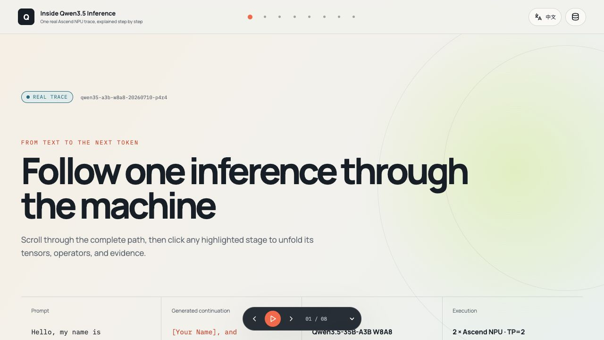

优点：页面立即说明 real trace、run ID、prompt、model 和 TP=2；版式干净，主标题可读。

主要问题：选定稿的首个核心画面是 `Load weights → Tokens → Embedding → 40 layers → Logits → completion` 的全局数据流，而当前首屏是大面积 hero、背景圆和底部元数据。用户必须先滚动，仍无法在一个画面建立完整推理心智模型。

这不是色彩差异，而是主任务入口被“品牌开场”替换。P6 应保留简短标题，但把全局推理流提升到首屏主体。

### Step 2 — Initialization：严重不完整

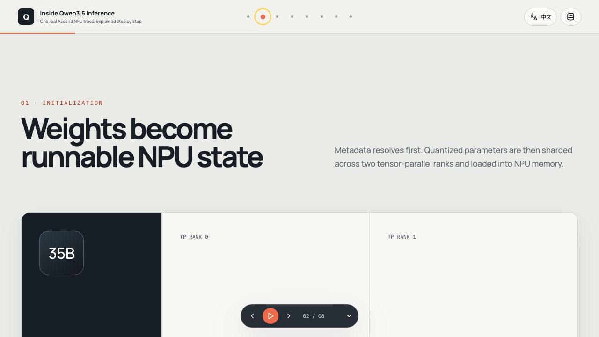

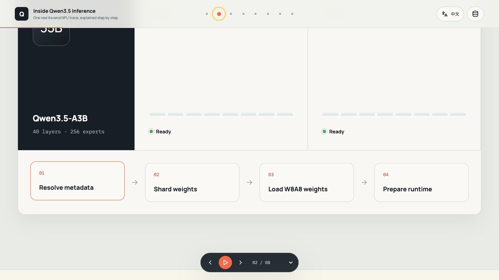

当前画面有模型、Rank 0/1、Ready 状态和四个阶段：Resolve metadata、Shard weights、Load W8A8 weights、Prepare runtime。

缺少原方案要求的可解释初始化链：

```text
config
→ 40-layer skeleton
→ quant description
→ TP processes/ranks
→ 10 checkpoint shards
→ parameter mapping and local shards
→ NPU memory
→ KV cache
→ dummy forward / graph capture / warmup
→ READY
```

Rank 面板在章节开头大面积空白；下半部是四张静态卡，未显示真实分片名称、shape/dtype/quant、目标 rank、KV Cache 或 warmup/graph capture。初始化是用户最初明确提出的重点，目前只达到目录级概述。

### Step 3 — Prefill / 40 layers：部分可用

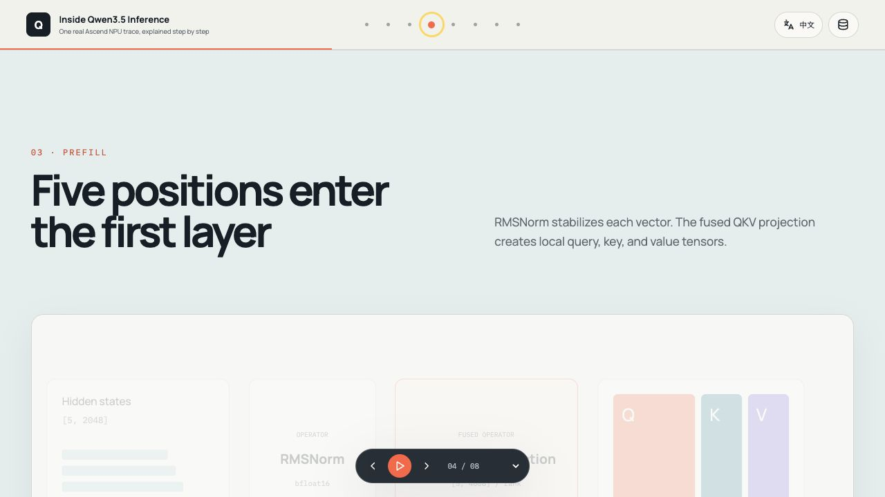

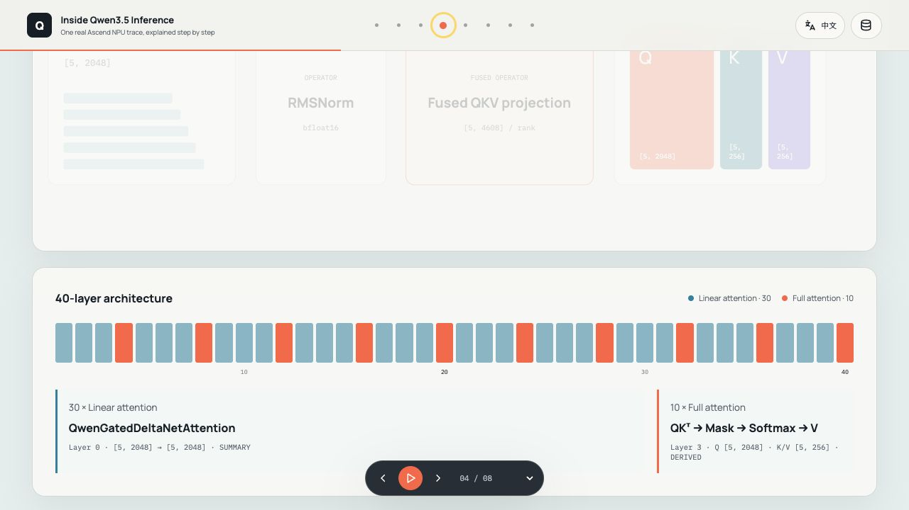

优点：页面真实展示 40 层、30 linear / 10 full attention，并提供代表性层和 fidelity。

问题：Prefill 顶部首先显示淡化的 Hidden states、RMSNorm、Fused QKV 和 Q/K/V 卡，40 层地图位于下一个视口。两部分更像上下相邻的静态 panels，而不是输入矩阵进入层栈的连续几何变化。导航跳到章节起点时，多数 operator 卡接近不可见，用户需要滚动才能发现真正有信息的 40-layer map。

### Step 4 — Attention：交互可用，教学链不完整

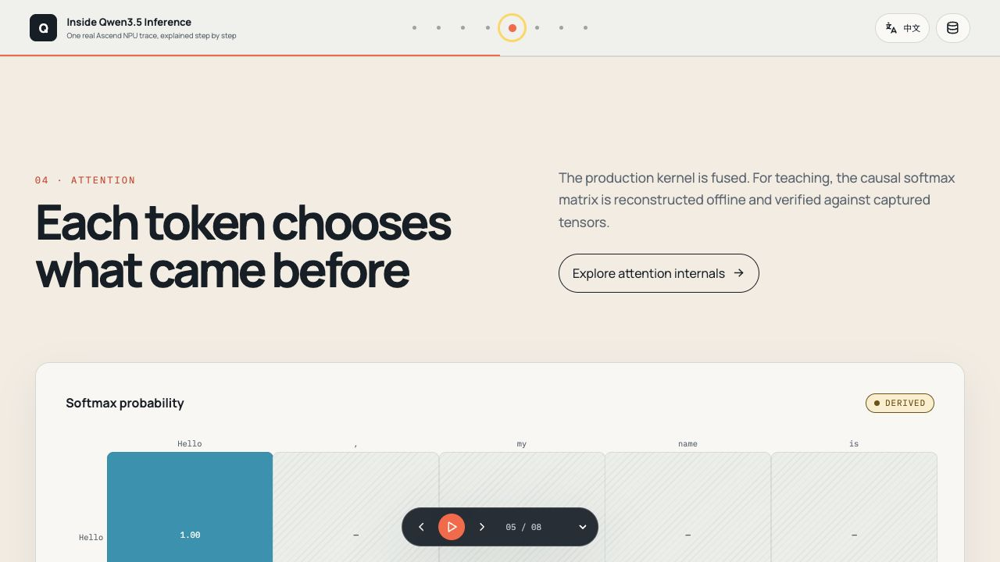

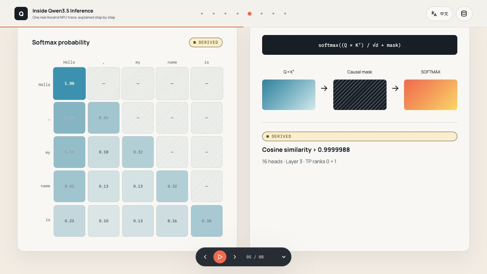

确认通过的行为：真实点击可展开；`Attention internals` 区域位于视口内；5×5 DERIVED 热力图和 `> 0.9999988` 验证证据正确显示。

与选定稿的关键差异：

- 没有 5 个输入 Token rows；
- 没有 captured Q/K/V 矩阵列；
- 没有逐步出现的 `QKᵀ → scale/mask → softmax → probabilities × V → output`；
- 没有 rank/head selector；
- “Q×Kᵀ / Causal mask / SOFTMAX”只是三块通用渐变卡，不是由真实矩阵和共享时间线驱动的内部动画；
- 没有 weighted sum 和真实 fused output 的视觉比较。

因此当前点击结果证明“区域展开了”，没有实现用户要求的“点击流程后展开具体细节的动态图”。

### Step 5 — MoE / W8A8：真实路由存在，计算链缺失

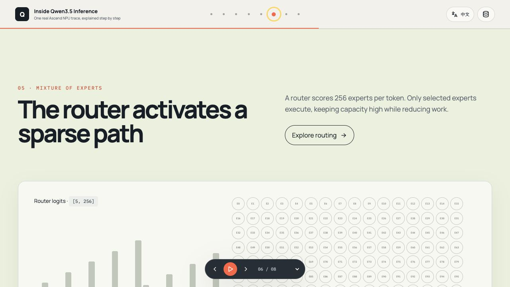

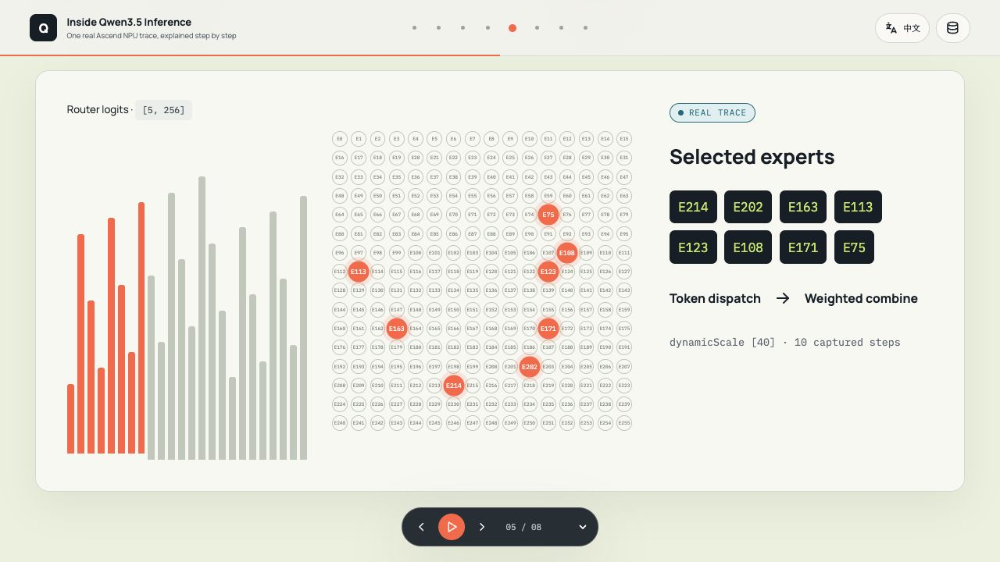

确认通过的行为：256 experts 可见，真实 top-8 为 E214、E202、E163、E113、E123、E108、E171、E75；详情区域在视口内。

主要问题：详情只展示 router bars、256 个微小 expert 节点、selected experts 和 `Token dispatch → Weighted combine`。`p4r4` 已具备的真实教学内容没有形成可见链路：top-k weights、40 dispatched rows、per-token dynamic scale、INT8 activation、GMM1/SwiGLU、GMM2、BF16 output、两个 TP rank 的差异和 combine。

256 个专家全部绘制是结构正确，但默认节点尺寸太小，绝大多数标签不可读；视觉重点应是“256 容量 + 当前 top-8 路径”，而不是让 256 个同权节点占据主要面积。

### Step 6 — Tensor Parallel：双 rank 可见，内部过程退化为表格

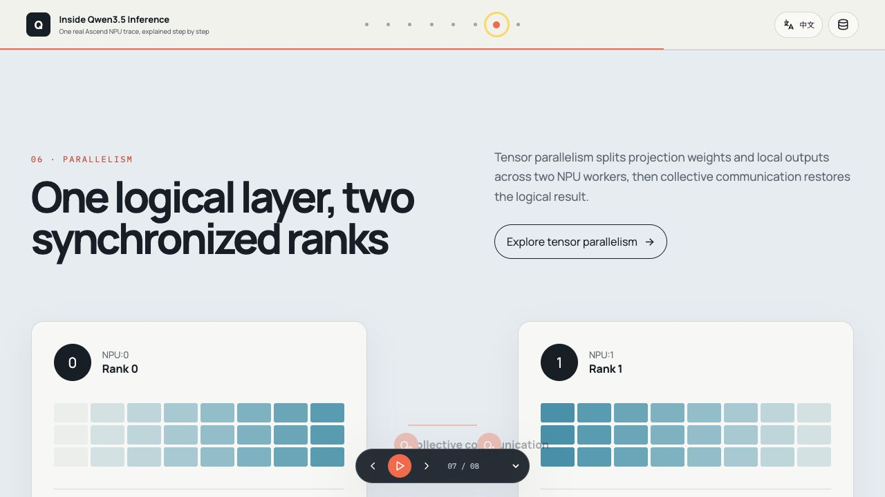

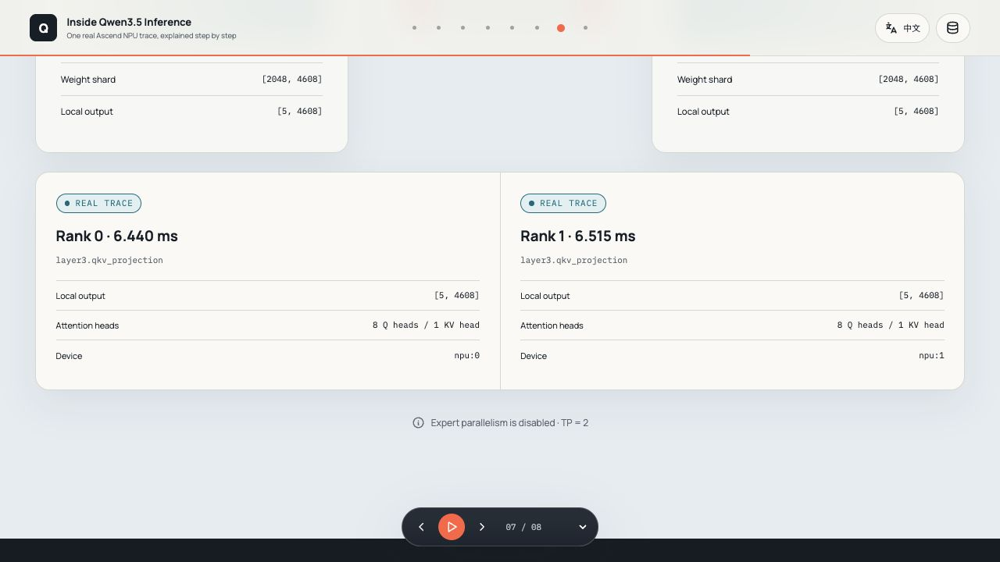

确认通过的行为：Rank 0/1、真实 `[2048, 4608]` 权重、`[5, 4608]` local output、6.440/6.515 ms、8 Q / 1 KV head 和 NPU 设备均可见。

选定稿要求每条 rank lane 连续展示：

```text
weight shard
→ local QKV / prefill
→ local MoE + W8A8
→ collective communication
→ local logits
→ merged result
```

当前展开后只增加两张静态事实卡，且自动滚动把上方 rank 结构裁掉。用户看不到两条任务如何并行推进、在哪一步同步、数据如何重新合并。这是“展示两份数据”，不是“展示并行过程”。

### Step 7 — Decode：数据正确，叙事状态矛盾

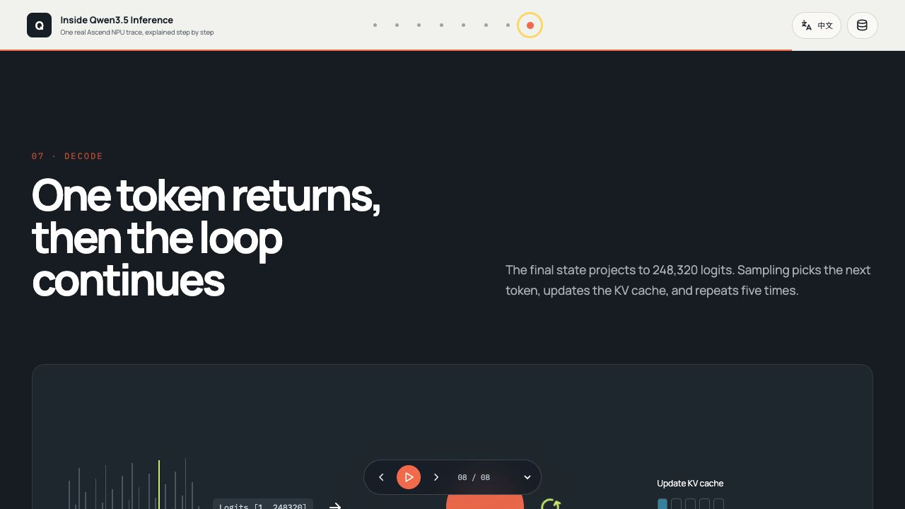

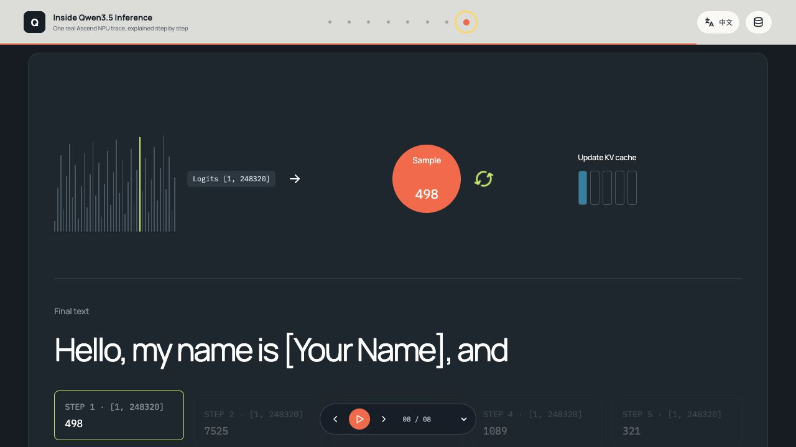

优点：dark scene 能明确标出 logits、sample、KV Cache、5 个真实 token IDs 和最终文本。

问题：章节刚进入时只有 STEP 1 高亮，Sample 为 498，KV Cache 只增长一格，但 `Hello, my name is [Your Name], and` 已完整显示。画面同时表达“刚生成第一个 Token”和“已经生成完五个 Token”，破坏了因果故事。

修复后应让文本、KV Cache、active step 和 sample 同步增长；只有 STEP 5 完成后才出现完整 final text。

### Step 8 — English / 中文：基本健康

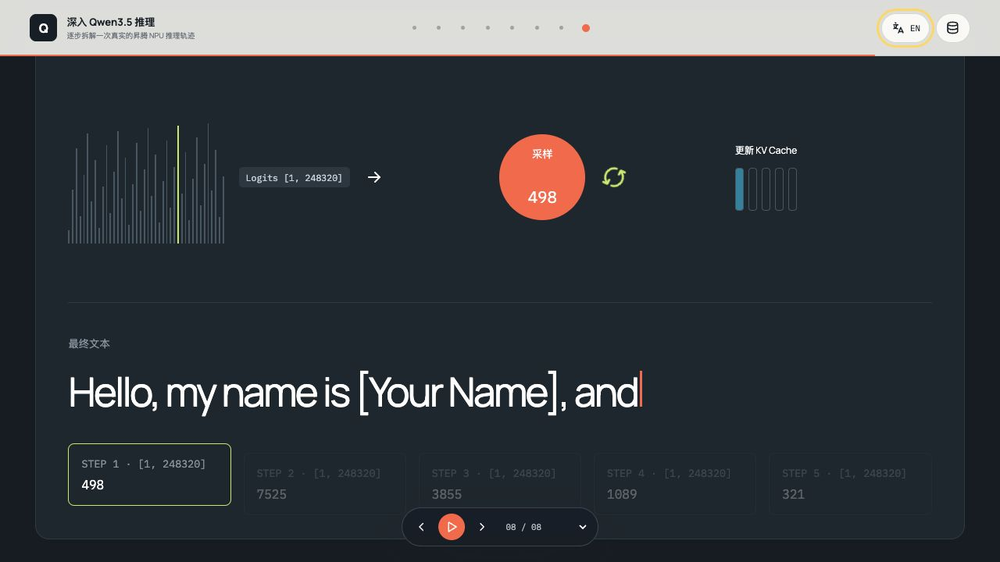

确认通过：切换中文后仍停留在 Decode，player 保持 `08 / 08`，当前可视章节未重置；标题和主要说明完成翻译。

剩余问题：URL 使用 `?lang=zh`，而冻结契约写的是 `zh-CN`；Decode step 卡仍显示 `STEP`。需要决定统一 locale ID，并把真正的界面词纳入 catalog，shape、dtype、ID 和模型输出继续保持原样。

### 自动播放观察

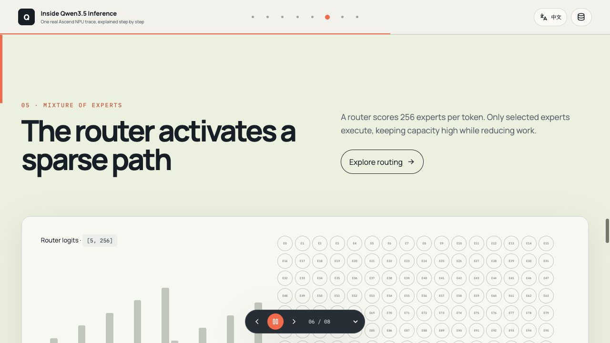

当前自动播放可以驱动镜头，不再只是进度条。但本轮连续观察中，章节大约以一秒级节奏推进；用户很难在播放状态读完解释或理解矩阵变化。速度下拉框的 DOM `value` 为空、`selectedIndex=-1`，画面只显示下拉箭头，看不到当前速度；选择 `0.5×` 后也没有形成可见的 selected value。

播放器还持续悬浮在画面底部中央，并在 Attention、TP 和 Decode 截图中覆盖主要内容或 step cards。

## 5. 可访问性风险

以下是截图和 DOM 能确认的风险，不等于完整 WCAG 审计：

1. 顶部章节按钮的 accessible name 只有 `0`–`7`，屏幕阅读器和语音控制用户无法知道各按钮代表 Initialization、Tokens、Attention 还是 Decode。
2. Playback speed combobox 没有当前 selected option，既是视觉问题，也是状态可感知问题。
3. Prefill 未激活卡和 Decode STEP 2–5 的文字对比度很低，需要做实际对比度测量。
4. 256 个专家节点极小，标签和交互目标无法作为独立可读元素使用。
5. 固定 player 会覆盖内容；键盘聚焦到被遮挡区域时可能难以理解当前位置。
6. 自动镜头以一秒级跨章节，需要确认 `prefers-reduced-motion`、暂停后的焦点保持和状态变更提示。

## 6. 必须修复的优先级

### P0 — 恢复产品骨架

1. 将首屏改为视觉稿中的全局推理流，节点可点击，标题只占辅助位置。
2. 让 Initialization、Attention、MoE/W8A8 和 TP 使用共享场景时钟和连续几何展开，不再以附加静态卡片作为详情。
3. Attention 补全 Token、Q/K/V、scores、mask、softmax、weighted sum、output 和 head/rank selector。
4. TP 补全两条 lane 的 shard→local work→collective→merge；MoE 补全真实 W8A8/GMM 链。
5. Decode 从空 completion 开始，随 5 个步骤同步增长文本和 KV Cache。

### P1 — 可理解的播放与导航

1. 自动播放总时长改为以“分钟”而不是“数秒”理解；每个语义阶段至少允许读完当前解释。
2. 修复速度选择器的当前值和切换结果。
3. 播放器避免遮挡当前主要内容；Focus Scene 打开时可折叠或移动到画布边缘。
4. 章节按钮使用完整可访问名称，并在视觉上显示当前章节含义。

### P2 — 视觉和响应式细节

1. 恢复选定稿的暖白、indigo/violet 和有限 Q/K/V/rank 色彩；减少每章节完全换背景的 landing-page 感。
2. 降低超大标题比例，把宽度与纵向空间交还给真实矩阵和数据流。
3. 重新处理 256 experts 的语义缩放、低对比度状态、中文长文本和小屏摘要。

## 7. 推荐实现切片

为避免再次一次性重写后才发现偏离，按三个可验收切片实现：

1. **Shell + Global Flow + Playback**：首屏全局流、带名称章节导航、播放器节奏/速度、sticky/shared canvas；完成后先截图与操作验收。
2. **Initialization + Attention Focus Scene**：先完成两个最能证明“连续动态图”的章节，包含真实 `p4r4` 数据和完整展开序列；完成后再次验收。
3. **MoE/W8A8 + TP + Decode + bilingual/a11y**：补齐并行链、五步输出、语言和可访问性，最后运行完整 P6 Gate。

每个切片都要同时具备：参考图对照、组件测试、真实 pointer hit、viewport intersection、两个时间点的正文变化，以及用户验收。

## 8. 证据边界

- 本次只审计 1280×720 桌面流程，没有声称移动端或缩放模式合格。
- 截图无法证明完整键盘顺序、屏幕阅读器输出、真实对比度和 reduced-motion 行为；这些仍需专项测试。
- 截图能证明展开结果和视觉结构，但连续动画的最终质量需要录屏或确定性的多帧浏览器断言。
- 未修改网页实现；本步骤只冻结可审计差异和下一轮实现范围。
