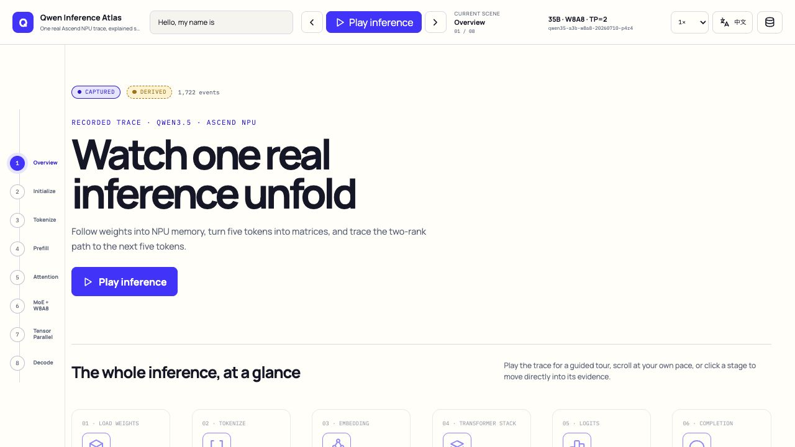
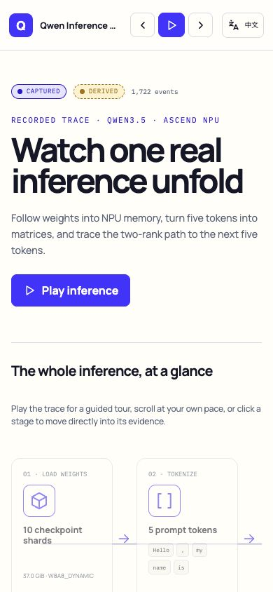
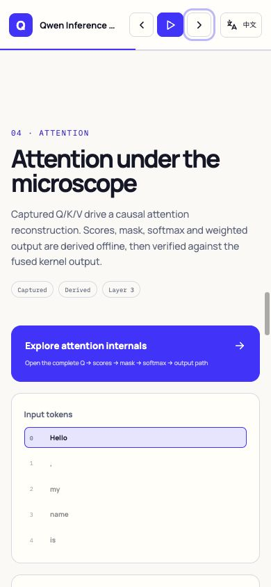
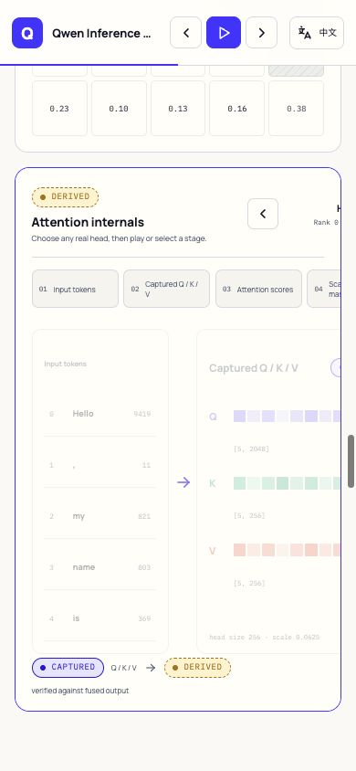
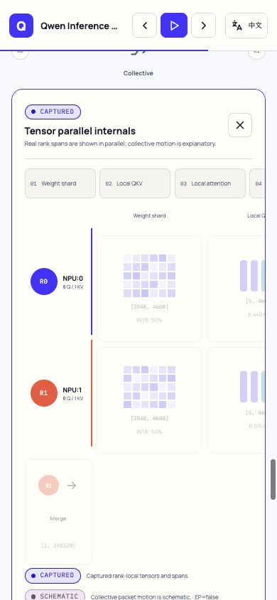
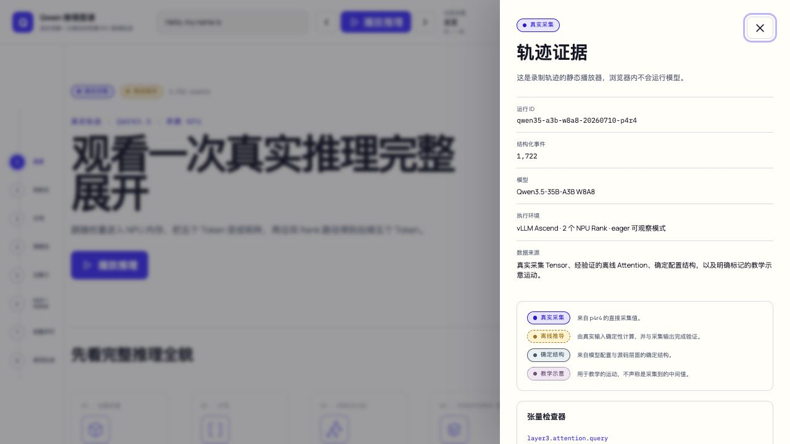

# P7 readiness audit: responsive, keyboard and bilingual behavior

- Date: 2026-07-13
- Local prototype: `http://127.0.0.1:4173/?lang=en`
- Trace: `qwen35-a3b-w8a8-20260710-p4r4`
- Viewports: 1280 × 720 and 390 × 844
- Scope: current-run browser evidence plus automated regression checks

## 1. Desktop opening — healthy

The opening remains a wide editorial scrollytelling page rather than a dashboard or slide deck. The fixed transport, global inference path, long chapter sequence and real trace badges are visible. The desktop document width equals the viewport width.

## 2. Mobile summary — healthy after correction

At 390 px the page now provides a summary composition: evidence cards use two columns, chapter scenes stack vertically and the document has no global horizontal overflow (`scrollWidth = innerWidth = 390`). An explicit `?lang=en` now takes precedence over a previously saved Chinese locale; a regression test covers this rule.

## 3. Attention entry and focused theater — healthy

The Attention focus action appears before the summary matrices on narrow screens and stays inside the viewport. Expanding it creates a real labelled region. The detailed six-stage theater scrolls inside its own 356 px container instead of widening the whole document.

## 4. Tensor-parallel focus and sequence — healthy

The TP action is visible at the chapter landing point. The focused region contains both NPU rank lanes, seven selectable stages and a `Play sequence` control. Browser sampling after playback showed stages 01–04 becoming active cumulatively; this is content-state motion, not progress-bar-only motion. Its 1215 px teaching theater is intentionally horizontally scrollable inside the 356 px focus region.

## 5. Chinese evidence dialog — healthy after correction

The Evidence panel is a labelled modal dialog with `aria-modal=true`. Opening it moves focus to Close; Escape closes it and returns focus to the trigger. Navigation labels, provenance and all fidelity definitions are localized rather than leaving explanatory English inside the Chinese UI.

## Findings fixed in this audit

1. **P1 responsive structure:** Attention/MoE/TP actions were pushed off-screen by desktop minimum widths. Narrow layouts now stack the overview and place the focus action first.
2. **P1 locale determinism:** saved `zh-CN` previously overrode an explicit `?lang=en`. The URL now has precedence.
3. **P1 dialog accessibility:** Evidence lacked dialog semantics, focus placement, Escape dismissal and focus restoration. All four behaviors are implemented and covered by tests.
4. **P2 bilingual completeness:** hard-coded English provenance and fidelity definitions were moved into the locale catalog.

## Automated evidence

- `npm run check`: 0 errors, 0 warnings.
- `npm test -- --run`: 7 files, 26 tests passed.
- `npm run build`: successful static production build.
- Added regression coverage for dialog focus/Escape, localized evidence, global keyboard playback/navigation, focused-scene Escape and explicit URL locale precedence.
- Current browser logs contain only Vite debug connection messages; no warning or error entries.

## Remaining limits and gate

- The screenshots cover desktop and a representative 390 px narrow viewport; a full device/browser matrix is not claimed.
- Wide Attention/MoE/TP internals intentionally use local horizontal scrolling on narrow screens because their matrix and parallel-lane relationships cannot be compressed without losing meaning.
- Fusion-kernel softmax remains explicitly `Derived`, and collective packet motion remains `Schematic`.
- Automated and browser checks do not close the product/visual gate. The user must still operate and accept the prototype.

Final result: passed for the tested P7-readiness scope; user acceptance remains open.
