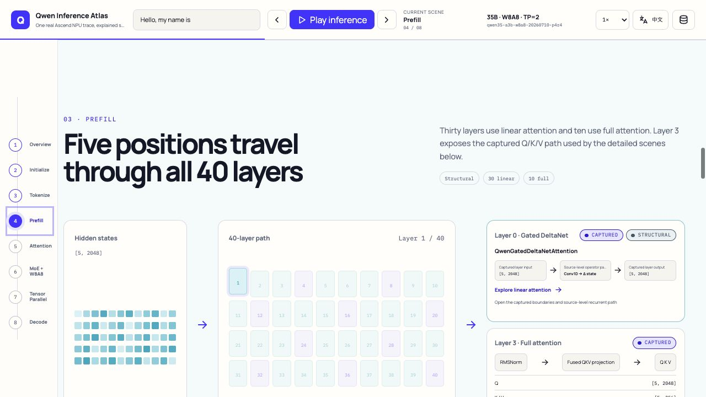
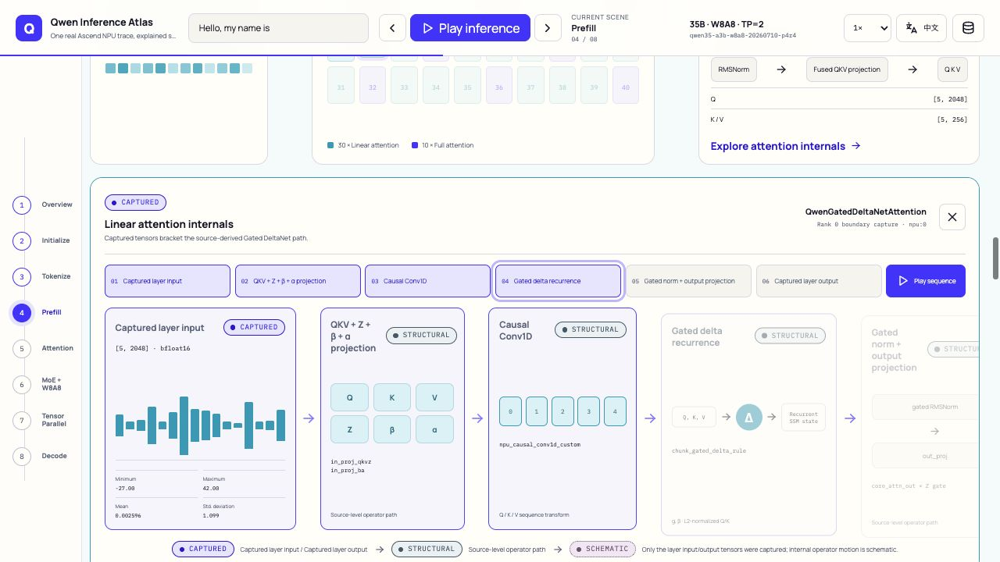
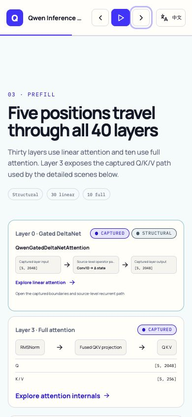
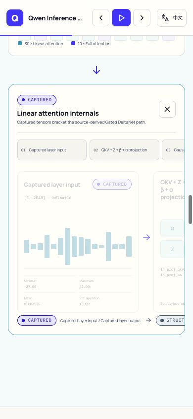

# 完成性审计：原始要求逐项核对

- 日期：2026-07-13
- 页面：`http://127.0.0.1:4173/?lang=en`
- 真实轨迹：`qwen35-a3b-w8a8-20260710-p4r4`
- 视口：1280 × 720、390 × 844
- 原则：不能用“测试通过”代替页面中真实可见、可点击的证据

## 1. 本轮发现的真实缺口

此前页面和测试能证明 40 层中有 30 层 `linear_attention`、10 层 `full_attention`，也能展开全注意力，但线性注意力只有层类型标签和输入 shape，没有可展开的代表层内部过程。因此 `TASKS.md` 中“实现 linear attention 代表层”的完成证据不足。

本轮补充了 Layer 0 `QwenGatedDeltaNetAttention` 场景：

- 真实采集 Rank 0 输入 `[5, 2048]`、输出 `[5, 2048]` 的 BF16 受控样本和 min/max/mean/std；
- 源码级结构路径：`QKV + Z + β + α projection → Causal Conv1D → Gated Delta recurrence → gated RMSNorm → out_proj`；
- 六阶段可点击、可连续播放；
- 输入/输出标记 `Summary`，源码确定的算子标记 `Structural`，内部状态运动标记 `Schematic`；`Captured` 只用于完整直接值，不把摘要或未采集的内核内部值冒充完整采集数据。

## 2. 桌面 40 层与双注意力入口 — healthy

Prefill 同时显示真实 40 层混合结构，以及两个明确入口：

1. Layer 0 Gated DeltaNet / linear attention；
2. Layer 3 full attention / QKV microscope。

两者不再只是图例或静态文字。

## 3. 线性注意力阶段推进 — healthy

直接选择第 4 阶段后，前四个步骤与对应内容面板进入 active 状态；真实浏览器连续采样也记录到 progress `0.053 → 0.092 → 0.131 → 0.171`，输入面板 stage `0.316 → 0.555 → 0.789 → 1.0`，证明正文内容随时间推进，而不是只有顶部进度条变化。

注：截图生成后又完成了一次不改变布局和交互的真实性术语纠偏，图中的 Linear 边界 `Captured` 徽标已在最终代码中改为 `Summary`。最终标签由页面组件回归和 Evidence 定义覆盖；本截图只作为阶段推进与构图证据。

## 4. 390px 摘要入口与 Focus — healthy

390px 章节落点中，线性与全注意力入口都在首屏内。展开后 Focus region 宽 356px，内部教学画布宽 1485px，只在 region 内横向滚动；文档宽度仍等于 viewport 的 390px。

## 5. 原始要求完成证据

| 原始要求 | 当前权威证据 | 结论 |
|---|---|---|
| 推理前初始化、权重加载 | 10 shards、37.0 GiB、W8A8、TP ranks、KV cache、runtime probe、READY 动态顺序 | 已证明 |
| Token 逐步变矩阵 | 精确 prompt/token IDs 与真实 `[5, 2048]` embedding 场景 | 已证明 |
| 40 层、线性/全注意力 | 30/10 精确层图；本轮 linear Focus；既有 full Attention 六阶段 | 已证明 |
| Attention softmax 教学 | 真实 Q/K/V 离线重建，16 heads，并与融合输出余弦相似度验证 | 已证明，明确 `Derived` |
| MoE、W8A8、并行 | 256 experts、真实 top-8、两 rank 量化链、TP 七阶段同步 lane | 已证明 |
| Decode 到最终输出 | 五次精确 token/logits/KV cache 决策与最终字符串 | 已证明 |
| 连续动态而非图片轮播 | 共享 PlaybackEngine 驱动章节、内容 stage 和镜头；各 Focus 有阶段按钮与 Play sequence | 已证明 |
| 点击流程展开详情 | Linear、Attention、MoE、Tensor Parallel 均为真实按钮和 labelled region | 已证明 |
| English 默认和中英文切换 | URL locale 优先、完整 catalog、切换保留 Focus/stage/speed | 已证明 |
| 长/宽页面而非 A4 | 全宽纵向 scrollytelling、固定章节轨、局部宽矩阵剧场 | 已证明 |
| UT/回归保证 | 7 files / 29 tests；页面真实点击、数据事实、过渡竞态和失败模式均覆盖 | 已证明 |

## 6. 额外修复

- 增加缺失的 `--blue` 设计 token，使默认 Attention score/probability matrix 真正显示紫蓝热力颜色，而不是退化为无色背景。
- 补齐独立 `Summary / 真实摘要` fidelity 与 Evidence 定义；Linear Attention 的受控样本/统计不再误标成完整 `Captured`。
- Full-attention 代表卡使用独立 accessible name，避免与主 Attention 展开按钮混淆。
- 生产静态构建为 4.6 MB，其中发布 trace 为 4.0 MB；主页面 JS 约 149 KB，gzip 约 45 KB。

## 7. 自动化与浏览器证据

- `npm run check`：0 errors，0 warnings。
- `npm test -- --run`：7 files，29 tests passed。
- `npm run build`：成功，adapter-static 写入 `web/build`。
- 真实浏览器：Linear Focus 六个 panel、阶段直达、连续 progress、中文状态保持、桌面/移动端无全局横向溢出均通过。
- 当前浏览器 warning/error：0。

### 最终 fidelity 与可逆过渡复验

- 最终静态构建在稳定验收地址 `http://127.0.0.1:4174/?lang=en` 重新加载；该地址返回 200，并在浏览器中加载 `p4r4`。
- Linear entry 与 Focus 均显示 `Summary`；Evidence 同时出现 Captured/Summary/Derived/Structural/Schematic 五级定义。
- 0.5× 连续采样：scene progress `0.052 → 0.057 → 0.061 → 0.065 → 0.069`，输入 stage `0.316 → 0.341 → 0.366 → 0.391 → 0.416`。
- 复验发现并修复 closing 期间快速重新点击入口会再次关闭的竞态；修复后 650ms 仍有一个 `Linear attention internals` region，入口 `aria-expanded=true`。
- 最终 region top `107.31`、bottom `613.08`，与 720px viewport 相交；`scrollWidth = innerWidth = 1280`；console warning/error 为 0。

## 8. 尚未被机器替代的 Gate

工程、数据、交互、响应式和构建要求已有直接证据，但“整体效果是否达到用户期望”仍必须由用户亲自操作判断。该审计不能代替产品/视觉接受，也不自动授权 commit、push 或部署。

Final result: engineering completion evidence passed; user product/visual acceptance remains open.
