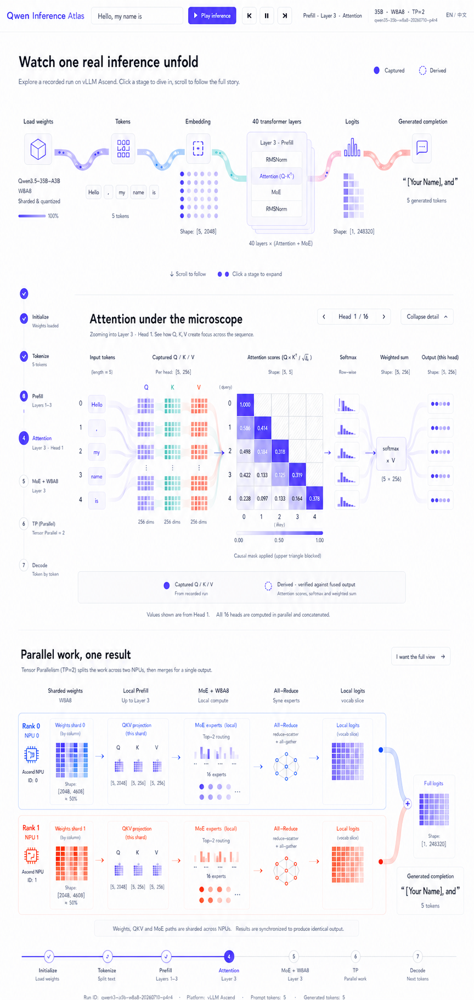

# 视觉与交互实现契约

> 本文件把已选视觉方向从“灵感参考”提升为 P6 的实现基准。任何明显偏离都要先说明原因并获得用户确认，不能在上下文压缩后自由改成另一种页面。

## 1. 唯一选定视觉稿



仓库资产：`docs/assets/p5-fused-long-scroll-direction.png`

参考体验：

- [Transformer Explainer](https://poloclub.github.io/transformer-explainer/)
- [poloclub/transformer-explainer source](https://github.com/poloclub/transformer-explainer)

参考站点提供的是交互语法和连续矩阵解释思路，不是要复制其 GPT-2 模型结构。项目独特内容必须是 Qwen3.5、Ascend、初始化、W8A8、MoE、TP=2 和真实 `p4r4` 轨迹。

## 2. 视觉稿表达的页面骨架

选定稿不是一张普通落地页，而是同一页面中三个连续缩放层级：

### A. 全局推理长卷

- 顶部固定控制包含 prompt、播放/暂停、前后步骤、当前阶段、模型/量化/TP 信息和语言切换。
- 首个主画布横向展示 `Load weights → Tokens → Embedding → 40 layers → Logits → completion`。
- 柔和流带连接矩阵/节点，当前数据沿路径连续运动。
- 页面左侧或等价位置保留纵向章节进度，使用户始终知道当前处于初始化、Token、Prefill、Attention、MoE、TP 还是 Decode。

### B. Attention 矩阵剧场

- 由全局 40-layer/Attention 节点在同一页面展开，而不是跳到新页面或弹出一张图片。
- 需要同时看清 Token rows、Q/K/V、QKᵀ scores、mask、softmax、weighted sum 和 output。
- 默认可展示 16-head 平均结果，并允许 rank/head 切换；标注 Captured Q/K/V 与 Derived probabilities。
- 展开区域获得主要视觉空间，其他内容降权；收起后回到原进度。

### C. Tensor Parallel 双轨

- Rank 0 / NPU 0 与 Rank 1 / NPU 1 形成两条对称、同时推进的轨道。
- 每条轨道显示权重分片、QKV/local work、MoE local experts、collective、local logits，再合并为完整结果。
- 两 rank 的真实 span 可以解释并行和同步，但 eager duration 不作为 graph 性能基准。

三个层级属于同一条长页面故事，不是三套 UI，也不是同一屏同时堆满。

## 3. 页面尺寸与密度

- 主可视化使用接近 `100vw` 的宽度；不能被文章 `max-width` 限制成窄卡片。
- 页面允许纵向变长，但章节高度由实际内容决定；正文章节主画布随文档移动，不使用人为的 sticky 滚动跑道。
- 1280px 以上提供完整体验；更宽屏幕扩大流程间距和 rank 轨道。
- 解释文字单独限制约 60–68 字符行宽，不反向限制可视化。
- 小屏提供摘要布局；不能把完整桌面矩阵简单整体缩小到不可读。
- 避免无意义的大面积空白；纵向空间必须服务章节推进、镜头或解释。
- 所有正文章节都随文档自然滚动，不能制造“滚动了但画面不动”的空跑区；长矩阵剧场与 TP 双轨通过内容宽度、Focus 展开和阶段动画聚焦，而不是 sticky 定位。

## 4. 视觉语言

- 暖白/浅色编辑表面，大量有目的的留白。
- 主色为 indigo/violet；Q/K/V 和两个 rank 只增加有限的 cyan/mint/coral。
- 使用矩阵块、向量、分片、合并点和柔和流带；避免通用 analytics 卡片、装饰性图表和玻璃拟态面板堆叠。
- 阴影仅用于临时浮层；章节主要通过对齐、留白和细分隔线分组。
- English 为默认 UI；字体和字号优先保证工程术语、shape 和小矩阵可读。
- fidelity 不只靠颜色，必须同时使用文字和线型/边框。

## 5. 连续动态契约

### 5.1 全局播放

- `Start` 提供从头、从当前页面、从当前步骤三种起点，以及单步、连续两种模式；从头仍进入 initialization。
- play/pause、previous/next、章节导航、scroll 和 speed 由同一个 `PlaybackEngine` 协调，但可视页面与推理游标必须是独立状态。
- 章节导航只改变可视页面，不补完、重置或移动推理游标；顶栏同时显示 Viewing 和 Cursor。
- 连续播放时镜头默认跟随推理游标；用户 wheel/touch/滚动条或章节导航后只把镜头控制权交给页面浏览，transport 与正文动画继续运行。再次显式开始会恢复自动跟随。
- 从 final frame 重播要回到开头，而不是停留在 `08 / 08`。

### 5.2 场景内容必须随时间变化

共享进度至少驱动以下内容：

- 权重分片/参数到 rank/NPU 的加载流；
- Token 出现、ID 和 embedding rows/cells；
- 40 层当前层、linear/full attention 类型和数据路径；Linear 代表层必须显示真实边界 Tensor，并把源码级内部路径与教学运动分别标记 Structural/Schematic；
- Attention 的 Q/K/V、scores、mask、softmax、weighted sum；
- MoE router、top-8、dispatch、W8A8 scale 和 expert combine；
- TP 两 rank 的 packet/span/local work 与 collective；
- logits candidates、greedy 选择、KV reuse 和 5 次 Decode 文本增长。

只有进度条、章节数字、按钮文案在变化，不算完成。

### 5.3 Focus Scene

统一状态：

```text
overview → expanding → detail → collapsing → overview
```

- 点击真实节点，而不是依赖隐藏在别处的详情按钮。
- 展开动作必须连续改变几何与视觉焦点；不能只是瞬间插入一段正文。
- 展开后区域必须与当前 viewport 相交；真实指针中心要命中控件。
- 打开详情时暂停播放并保留章节进度；关闭后恢复原位置。
- 展开/收起过渡必须可逆；关闭动画期间再次点击同一入口应立即重新展开，不能在延迟回调后消失。
- Linear Attention、Full Attention、MoE/W8A8、TP 至少各有页面级测试和真实浏览器路径。

## 6. 初始化必须是第一等章节

用户从项目发起时就要求“推理前，权重等是怎么加载上去的初始化”。因此初始化不能只画一条完成进度：

```text
config
→ 40-layer skeleton
→ quant description
→ TP processes/ranks
→ 10 checkpoint shards
→ parameter mapping + local shard
→ NPU memory
→ KV cache
→ dummy forward / graph capture / warmup
→ READY
```

默认不展示可恢复的权重值，只展示受控的 module、shape、dtype、quant type、rank、shard 和内存/进度证据。

## 7. English / 中文

- 初次加载使用 English；`?lang=zh-CN` 可切换中文。
- 所有 UI、解释、图例、无障碍标签、错误态和 Evidence 文案均必须双语。
- shape、dtype、token ID、run ID 和数值不翻译。
- 切换语言不得重置 transport、chapter、focus、progress 或已选 head/rank。
- 两种语言分别检查布局，不能把中文当成后补的局部翻译。

## 8. 反例与拒绝项

以下结果即使能运行也不符合方向：

- 一张通用 hero 加四个静态 feature cards；
- 页面像 A4、dashboard 或窄文章，把主画布限制在卡片内；
- 几张截图/状态卡按进度切换；
- 页面加载时 CSS 自己播放一次，之后与全局进度无关；
- 详情存在 DOM 中但落在视口外，或点击后只出现说明文字；
- 40 层、MoE experts、Decode 值由页面硬编码；
- 视觉风格完全换成新的 landing-page 方向，却没有用户确认。

## 9. 当前实现与契约的客观差异

已有 P6 截图 `p6-overview.png` 显示大标题、宽阔空白和四个概览卡片；它与选定稿中“横向贯通的数据流 + 立即可见的矩阵/层结构 + 向下矩阵剧场/TP 双轨”的主构图存在明显差异。后续虽修复了共享播放和点击可见性，尚未得到用户对视觉方向的重新验收。

因此：自动化结果可以证明部分行为已修复，但不能证明视觉稿已经被忠实实现。P6 当前仍未通过用户产品/视觉 Gate。

## 10. P6 视觉验收证据

下一次申请 P6 验收至少提供：

1. 1280×720 首屏、Linear/Full Attention 展开、MoE 展开、TP 双轨和 Decode 的截图/录屏；
2. 与本视觉稿按构图、密度、色彩、章节和交互逐项对照；
3. 正文内容在两个播放帧发生变化的机器断言；
4. Linear/Full Attention、MoE、TP 真实 pointer hit-test 和 viewport intersection；
5. English 和中文状态保持检查；
6. 用户实际操作验收。

第 6 项不能由前五项自动替代。
